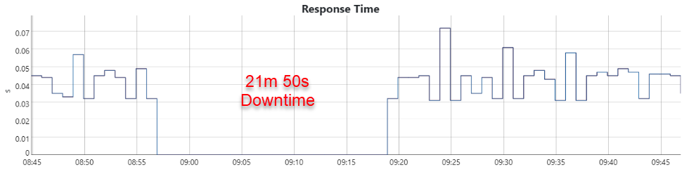
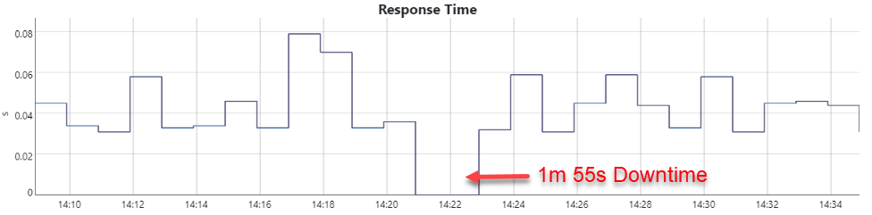
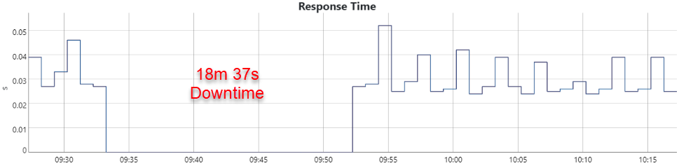
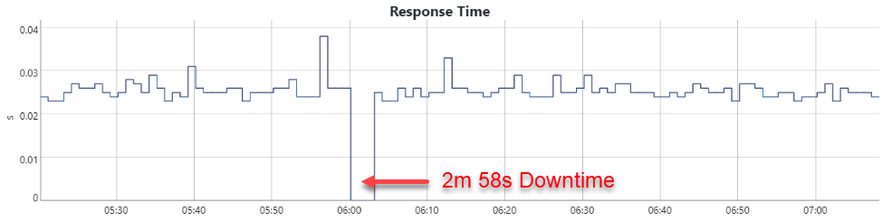
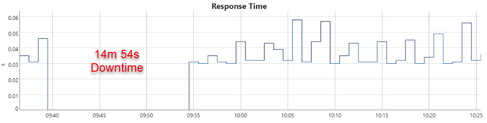
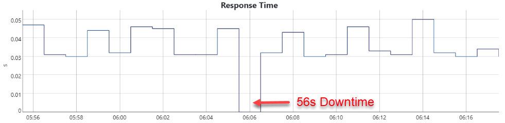
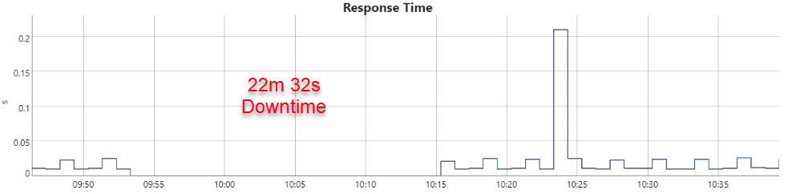
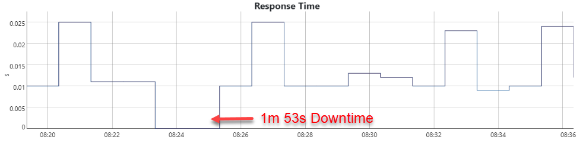

# Cluster overprovisioner
This tutorial describes how to overprovisioning of cluster nodes for scaling and failover. This is desired 
when you have work loads that need to scale up quickly without waiting for the new cluster nodes to be created 
and join the cluster.

A similar problem occurs when crashing a node from the Hyperscaler. This must be replaced by Kubernetes as fast 
as possible. The solution can be **overprovisioning** of nodes

> Overprovisioning: Allocating more computer resources than is strictly necessary 
> 
>   *https://en.wikipedia.org/wiki/Overprovisioning*

## When does the autoscaler change the size of the cluster?
Below is a description of how the cluster behaves when there is a requirement to scale. 

### Scaling without overprovisioning

 1. load hits the cluster (or a node is crashed)
 1. cannot schedule application-pods due to insufficient resources, scaling fails 💀
 1. cluster-autoscaler notices and begins to provision new instance
 1. wait for instance to be provisioned, boot, join the cluster and become ready
 1. kube-scheduler will notice there is somewhere to put the application-pods and will schedule them

### Scaling with Overprovisioning

 1. load hits the cluster (or a node is crashed)
 1. *placeholder-pods* are evicted, 
 1. **scaling of application-pod is immediately successful**
 1. placeholder-pods cannot be scheduled due to insufficient resources
 1. wait for instance to be provisioned, boot, join the cluster and become ready
 1. kube-scheduler will notice there is somewhere to put the placeholder pods and will schedule them

You can apply the above scenario one-to-one to the case when a node of the Hyperscaler dies.

## Real Scenario Test
We executed *normal* and *overprovisioning* tests on a gardener cluster on different infrastructure provider (aws, azure, gcp, 
alicloud). All of them tested the downtime of the application pod running in the cluster, when a node dies.

The test results for the different IaaS provider are shown below.

## Results
The results provided should only show how long the downtimes can be approximately.
> *The downtime results could vary +- 1 min, because the minimum request interval in UpTime is 1 minute*  

## AWS 

#### Normal

#### Overprovisioning

## Azure 
#### Normal

#### Overprovisioning

## GCP 
#### Normal

#### Overprovisioning

## AliCloud 
#### Normal

#### Overprovisioning

## Comparison

### Normal

| Provider        | AWS       | Azure     | GCP       | AliCloud  |
|-----------------|-----------|-----------|-----------|-----------|
| Node deleted    | 08:56     | 09:32     | 09:39     | 09:53     | 
| Pod rescheduled | 09:17     | 09:50     | 09:53     | 10:14     |
| **Downtime**    | 21 min    | 18 min    | 14 min    | 21 min    |

### Overprovisioning

| Provider         | AWS       | Azure     | GCP       | AliCloud  |
|-----------------------------------|-----------|-----------|-----------|-----------|
| Node deleted     | 14:20     | 06:00     | 06:05     | 08:23     |
| Pod rescheduled  | 14:22     | 06:02     | 06:06     | 08:25     |
| **Downtime**     | 2 min     | 2 min     | 1 min     | 2 min     |

## Test description
### Test 1 - Single-Node
In our first test case we have a cluster on any provider with the cluster-configuration: min. 1 and max. 3 nodes, 
so we have 1 running node in it. We have deployed a nginx web server, a service and an ingress to expose it. So we 
are able to call our endpoint with external tools like UpTime to check the availability of our nginx. It takes only 
a few seconds to deploy your nginx web server on kubernetes, so we could say: when your endpoint works, your node 
is up and running.

We wanted to test how much time it takes, when your node gets killed and your cluster has to create a new one to run 
your application on it. In our case we have a nginx web server running.  

The downtime is tested with UpTime, which does every minute a request to our endpoint. Further we checked manually, 
if the node startup time and the timestamps on UpTime are almost similar.  

For more information about the test steps have a look into the [tests/01-single-node-test](/tests/01-single-node-test) folder.

### Test 2 - Overprovisioning
Because the downtimes of the first tests were too long, we wanted to try overprovisioning. We had the idea, that we 
deploy a simple bash-pod with a low priority, which requests so much memory that it can't run on the same node with 
the nginx and your cluster has to create a second node to run it. The difference in our second test case is, that we 
have deployed priority classes and assigned them to the corresponding pods and have 2 running nodes instead of 1.  

> *Keep in mind, that the 2nd node is created automatically by the cluster-autoscaler and not manually*  

So what happens when your node, on which your nginx web server is running, gets deleted?  
The pod with the lower priority running on the other node will be terminated and your nginx pod with a higher 
priority will be deployed on that node.

We wanted to know how long it takes that your nginx web server is running again, when the node, on which your 
nginx is running, gets deleted.  

For more information about the test steps have a look into the [tests/02-overprovisioning-test](/tests/02-overprovisioning-test) folder.

